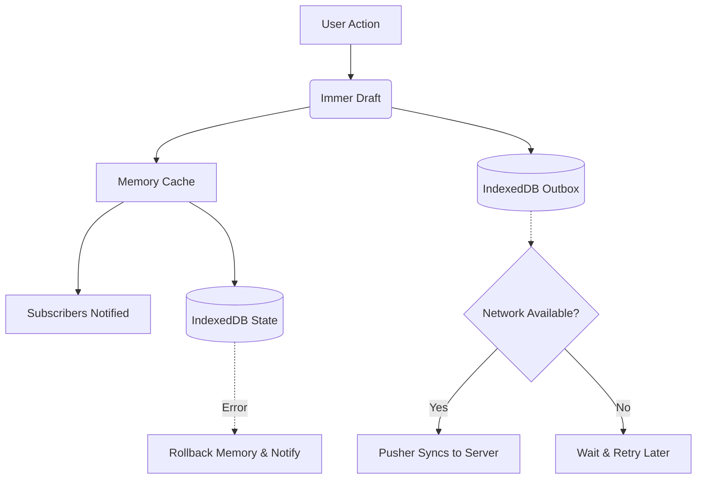

# Core Concepts

Syncraft Labs operates heavily on the concept of **Optimistic Updates** and **Eventual Consistency**. To use it effectively, you must understand the mental model behind its data flow.

## Data Flow

Every time you mutate state via `update()`, the data flows through several stages instantly:



1. **User Action:** You call `update(draft => { draft.count++ })`.
2. **Immer processing:** Immer intercepts the draft mutations and produces the `nextState`, as well as `patches` and `inversePatches`.
3. **Optimistic UI:** The in-memory cache is updated instantly. The UI re-renders synchronously.
4. **Persistence:** The `nextState` is written to IndexedDB. A new `OutboxEntry` is appended to the outbox queue in IndexedDB.
5. **Synchronization:** The background loop wakes up, reads the outbox, and attempts to push pending entries to the server.

### Optimistic Updates & Rollback

Because Syncraft Labs updates the memory instantly (before IndexedDB confirms the write), the UI never hangs on slow storage. 

However, if the IndexedDB write fails (e.g., due to strict storage quotas in private browsing), Syncraft Labs performs an **automatic rollback**:
1. The memory is reverted to the previous state using Immer's `inversePatches`.
2. All subscribers are re-notified with the reverted state.
3. The UI gracefully snaps back, and the `error` state is populated for you to render a warning.

## Architecture

Syncraft Labs is structured into three distinct layers to provide flexibility and SSR safety:

```
┌─────────────────────────────────────────────────────────────┐
│  Component Layer (React / Vue)                              │
│                                                             │
│  useSync("todos", { fetcher, pusher })                      │
│       │                                                     │
│       ├──▶ useSyncExternalStore / shallowRef                │
│       ├──▶ Auto-hydration (onMount)                         │
│       ├──▶ Background sync loop (pusher)                    │
│       └──▶ Network tracking (online/offline)                │
└─────────────────┬───────────────────────────────────────────┘
                  │
┌─────────────────▼───────────────────────────────────────────┐
│  Core Layer (@syncraft-labs/core)                           │
│                                                             │
│  createSyncStore<T>({ storageKey, initialState })           │
│       │                                                     │
│       ├──▶ In-memory cache (instant reads)                  │
│       ├──▶ Immer produceWithPatches (immutable mutations)   │
│       ├──▶ Subscriber notifications (sync, immediate)       │
│       └──▶ Optimistic update + rollback on failure          │
└─────────────────┬───────────────────────────────────────────┘
                  │
┌─────────────────▼───────────────────────────────────────────┐
│  Storage Layer (IndexedDB via idb)                          │
│                                                             │
│  Database: "syncraft-labs_{key}"                            │
│  ┌──────────────────┐  ┌────────────────────────┐           │
│  │  state store     │  │  outbox store          │           │
│  │  key: "current"  │  │  key: entry.id (UUID)  │           │
│  │  value: T        │  │  value: OutboxEntry<T> │           │
│  └──────────────────┘  └────────────────────────┘           │
└─────────────────────────────────────────────────────────────┘
```

## Storage Schema

Each `storageKey` you provide creates its own, isolated IndexedDB database prefixed with `syncraft-labs_`.

For example, `useSync("my-cart")` will create a database named `syncraft-labs_my-cart`.

Inside this database, there are two object stores:
1. **`state` store:** Holds exactly one row (`key: "current"`). This contains the latest snapshot of your data.
2. **`outbox` store:** Holds pending mutations. Each row is an `OutboxEntry` containing the exact Immer patches that were applied, a timestamp, and a UUID.
