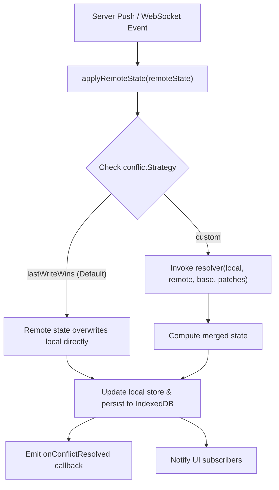

In local-first applications, clients mutate state optimistically while disconnected or asynchronously connected. When incoming remote data arrives from the server or peers, conflicts can arise between uncommitted local mutations and authoritative remote changes.

Syncraft Labs provides a **pluggable conflict resolution architecture** built directly into the core engine, supporting both default Last-Write-Wins (LWW) and fine-grained custom three-way merge algorithms.

---

## Conflict Resolution Lifecycle

The following diagram illustrates how incoming remote changes interact with local in-memory drafts and the outbox:



---

## Conflict Strategies

Syncraft Labs supports two primary strategies configured via the `conflictStrategy` option:

| Strategy | Behavior | Best Used For |
| :--- | :--- | :--- |
| `"lastWriteWins"` (Default) | Remote state received from the server unconditionally overwrites local state. | Single-user apps, simple document editors, settings panels. |
| `"custom"` | Invokes a user-provided `resolver` function receiving local, remote, base snapshots, and pending local patches. | Multi-user collaboration, complex nested state, field-level merges. |

---

## Strategy 1: Last-Write-Wins (Default)

Under Last-Write-Wins, incoming remote data is treated as the single source of truth. When `applyRemoteState(remote)` is called, the store directly adopts the remote state and updates its common base snapshot.

### React Example

```tsx
import { useEffect } from "react";
import { useSync } from "@syncraft-labs/react";

interface DocumentState {
  title: string;
  content: string;
}

export function Editor() {
  const { data, update, applyRemoteState } = useSync<DocumentState>("doc-123", {
    initialState: { title: "Untitled", content: "" },
    conflictStrategy: "lastWriteWins", // optional: default
  });

  // Listen to incoming WebSocket updates from server
  useEffect(() => {
    const ws = new WebSocket("wss://api.example.com/docs/doc-123");
    ws.onmessage = (event) => {
      const serverState = JSON.parse(event.data);
      void applyRemoteState(serverState);
    };

    return () => ws.close();
  }, [applyRemoteState]);

  return (
    <input
      value={data?.title ?? ""}
      onChange={(e) => update((draft) => { draft.title = e.target.value; })}
    />
  );
}
```

---

## Strategy 2: Custom Three-Way Merge

When `conflictStrategy: "custom"` is enabled, you supply a `resolver` function. The resolver receives a `ConflictInfo<T>` object containing:

- `local`: The current state in the client store (including optimistic edits).
- `remote`: The new state incoming from the server/peer.
- `base`: The last known synchronized snapshot shared by both client and server.
- `patches`: The array of pending, uncommitted local JSON patches.

### Field-Level 3-Way Merge Resolver

```tsx
import { useSync, type ConflictInfo } from "@syncraft-labs/react";

interface ProjectState {
  name: string;
  description: string;
  tags: string[];
}

function resolveProjectConflict({
  local,
  remote,
  base,
}: ConflictInfo<ProjectState>): ProjectState {
  // If local changed 'name' from base, keep local edit; otherwise take remote
  const name = local.name !== base.name ? local.name : remote.name;

  // If local changed 'description' from base, keep local; otherwise take remote
  const description =
    local.description !== base.description ? local.description : remote.description;

  // Union merge for tags array
  const tags = Array.from(new Set([...remote.tags, ...local.tags]));

  return { name, description, tags };
}

export function ProjectSettings() {
  const { data, update, applyRemoteState } = useSync<ProjectState>("project-42", {
    initialState: { name: "", description: "", tags: [] },
    conflictStrategy: "custom",
    resolver: resolveProjectConflict,
    onConflictResolved: ({ strategy, storageKey }) => {
      console.log(`[Syncraft] Conflict resolved using ${strategy} on store ${storageKey}`);
    },
  });

  // ...
}
```

---

## Vue 3 Composable Example

The exact same conflict resolution capabilities are available in Vue 3 via `@syncraft-labs/vue`:

```vue
<script setup lang="ts">
import { onMounted, onUnmounted } from "vue";
import { useSync, type ConflictInfo } from "@syncraft-labs/vue";

interface TaskState {
  title: string;
  completed: boolean;
}

const { data, update, applyRemoteState } = useSync<TaskState>("task-1", {
  initialState: { title: "New Task", completed: false },
  conflictStrategy: "custom",
  resolver: ({ local, remote, base }: ConflictInfo<TaskState>) => ({
    title: local.title !== base.title ? local.title : remote.title,
    completed: remote.completed, // Server status takes priority
  }),
});

let socket: WebSocket;

onMounted(() => {
  socket = new WebSocket("wss://api.example.com/tasks/1");
  socket.onmessage = (e) => {
    void applyRemoteState(JSON.parse(e.data));
  };
});

onUnmounted(() => {
  socket?.close();
});
</script>

<template>
  <div v-if="data">
    <h2>{{ data.title }}</h2>
    <button @click="update((d) => { d.completed = !d.completed; })">
      Toggle: {{ data.completed ? "Done" : "Pending" }}
    </button>
  </div>
</template>
```

---

## Vanilla JavaScript / TypeScript Core API

For non-framework applications, use `BaseStoreController` or the pure `resolveConflict` function directly:

```ts
import { resolveConflict, type Patch } from "@syncraft-labs/core";

const resolved = resolveConflict(
  localState,
  remoteState,
  baseState,
  pendingPatches,
  {
    strategy: "custom",
    resolver: ({ local, remote, base }) => ({
      ...remote,
      clientSpecificNote: local.clientSpecificNote,
    }),
  }
);
```

---

## Best Practices

1. **Keep Resolvers Synchronous and Pure**: The `resolver` function must be a synchronous pure function without network calls or side effects.
2. **Handle Incomplete Base States**: On cold start before the first sync loop completes, `base` will default to `local`. Ensure your resolver handles this gracefully.
3. **Log Conflicts**: Use the `onConflictResolved` callback to send telemetry to your logging or monitoring platform (e.g. Sentry, Datadog) to track collision frequencies.
4. **Prefer Granular State Stores**: Break large monolithic states into smaller domain-specific stores to minimize conflict blast radius.
