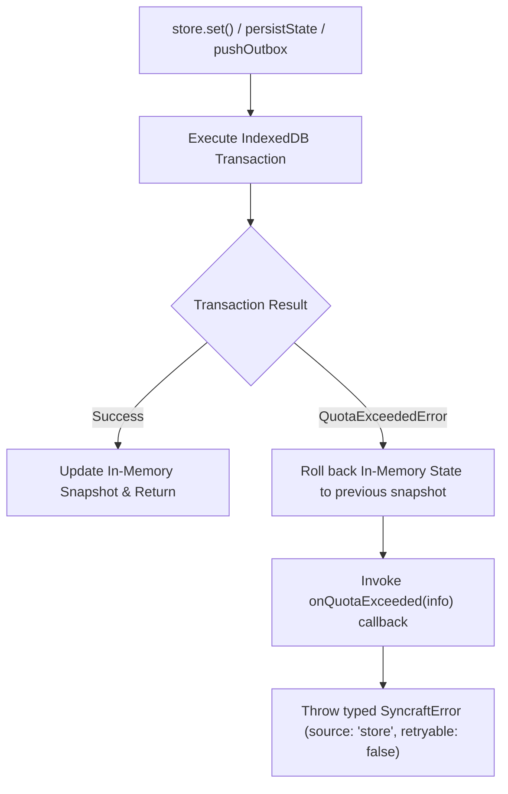

When running offline-first applications with rich local state, IndexedDB databases can encounter browser storage quota constraints. Browsers restrict the amount of disk space a web origin can utilize and throw a `QuotaExceededError` (DOMException) when exceeded.

Syncraft Labs provides built-in **automatic quota detection, error normalization (`SyncraftError`), and telemetry hooks (`onQuotaExceeded`)** to ensure graceful degradation and data protection.

---

## Browser Storage Quotas

Storage limits vary significantly across browsers and operating systems:

| Browser / Platform | Storage Allocation | Behavior When Exceeded |
| :--- | :--- | :--- |
| **Chromium** (Chrome, Edge) | Up to **60% of available disk space** per origin. | Throws `QuotaExceededError` (code 22). |
| **Firefox** (Gecko) | Up to **50% of available disk space** (max 10GB per origin). | Throws `NS_ERROR_DOM_QUOTA_REACHED` / `QuotaExceededError`. |
| **Safari & iOS WebKit** | Default **~1 GB**, prompts user for additional storage. | Throws `QuotaExceededError` (code 22). |
| **Private / Incognito** | Stricter ephemeral memory limits (typically ~100MB to 300MB). | Quota reached much earlier. |

---

## How Syncraft Labs Handles Quotas

Every IndexedDB operation (state snapshots, collection entity deltas, and outbox mutations) is protected by `withQuotaGuard`:



1. **Automatic Rollback**: If an IndexedDB write fails due to a storage quota error, optimistic changes in memory are automatically rolled back to preserve state consistency.
2. **Telemetry Hook**: `onQuotaExceeded` is fired with contextual metadata (`storageKey`, `operation`).
3. **Structured Error**: The failure is wrapped in a `SyncraftError` with `source: "store"` and `retryable: false`.

---

## Configuring `onQuotaExceeded`

### React Hook Example

```tsx
import { useSync, isQuotaExceededError, type QuotaExceededInfo } from "@syncraft-labs/react";

interface AppState {
  documents: Record<string, unknown>;
}

export function DocumentManager() {
  const { data, update, error } = useSync<AppState>("documents-store", {
    initialState: { documents: {} },
    maxOutboxSize: 50,
    overflowStrategy: "dropOldest", // Drop older queue items when full
    onQuotaExceeded: ({ storageKey, operation }: QuotaExceededInfo) => {
      console.warn(`[Storage Alert] IndexedDB quota reached during "${operation}" in "${storageKey}"`);
      // Send telemetry to monitoring service
      // Sentry.captureMessage(`Storage Quota Exceeded: ${storageKey}`);
    },
  });

  return (
    <div>
      {error && (
        <div className="error-banner">
          {isQuotaExceededError(error.cause) ? (
            <p>Your browser storage is full. Please free up disk space or clear old drafts.</p>
          ) : (
            <p>An unexpected error occurred: {error.message}</p>
          )}
        </div>
      )}
    </div>
  );
}
```

---

### Vue 3 Composable Example

```vue
<script setup lang="ts">
import { useSync, isQuotaExceededError } from "@syncraft-labs/vue";

interface CacheState {
  cachedItems: string[];
}

const { data, update, error } = useSync<CacheState>("app-cache", {
  initialState: { cachedItems: [] },
  onQuotaExceeded: ({ storageKey, operation }) => {
    alert(`Storage quota exceeded on ${storageKey} (${operation}). Evicting cache...`);
  },
});
</script>

<template>
  <div v-if="error">
    <p v-if="isQuotaExceededError(error.cause)">
      Browser disk quota exceeded.
    </p>
  </div>
</template>
```

---

## Mitigation Strategies

When handling large local-first datasets, apply these best practices to prevent reaching storage quotas:

### 1. Enable Outbox Compaction & Lower `maxOutboxSize`

Repeated updates to the same fields can accumulate pending patches in the outbox. Configure bounded outbox limits:

```ts
const store = createSyncStore({
  storageKey: "large-dataset",
  maxOutboxSize: 100,
  overflowStrategy: "dropOldest", // Prevent unbounded queue growth offline
});
```

### 2. Use Collection Mode for Large Datasets

In default `document` mode, the entire state object is rewritten on every change. In `collection` mode, only modified entities are updated in IndexedDB:

```ts
const store = createSyncStore({
  storageKey: "contacts-collection",
  storageMode: "collection",
  idField: "id",
});
```

### 3. Evict Stale Cached Data

When `onQuotaExceeded` triggers, programmatically evict old transient records or clear non-essential store instances using `destroyStore(registry, key)`.
