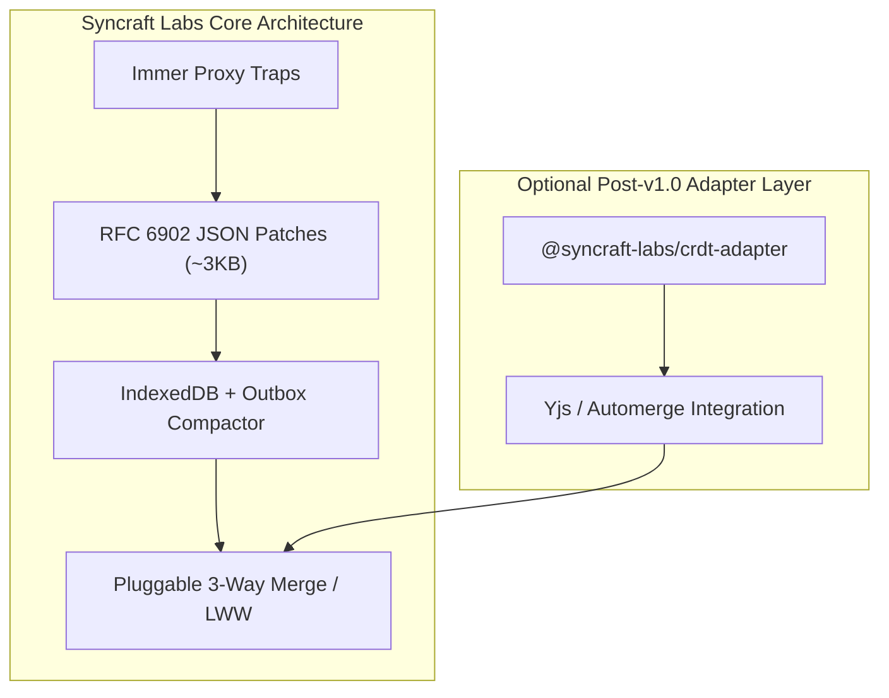

This document summarizes the architectural evaluation of **Conflict-free Replicated Data Types (CRDTs)** versus **JSON Patches (RFC 6902)** for Syncraft Labs, originally documented in [RFC-001](https://github.com/denislistiadi/syncraft-labs/blob/main/docs/rfcs/RFC-001-crdt-evaluation.md).

---

## Executive Summary

| Question | Evaluation & Decision |
| :--- | :--- |
| **Is CRDT built into Core v1.0?** | **No (Out-of-scope for v1.0)**. The keyword `"crdt"` has been removed from `@syncraft-labs/core` metadata to maintain honesty with developers. |
| **Why not embed CRDTs in Core?** | CRDT engines (such as Yjs or Automerge) add **50KB–80KB+** in bundle size and require complex non-standard data types. Syncraft Labs prioritizes a **~3KB lightweight footprint** with native JavaScript objects. |
| **How are conflicts handled today?** | Via the **Pluggable Conflict Resolution engine** (`conflictStrategy: "lastWriteWins" | "custom"`), which supports 3-way field-level merges and WebSocket server reconciliation. |
| **What is the future roadmap for CRDTs?** | Post-v1.0, an optional external package (`@syncraft-labs/crdt-adapter`) will be introduced for specialized collaborative text editing use cases. |

---

## Technical Comparison

### Trade-Off Analysis

1. **Bundle Size**:
   - JSON Patch Engine: **~3 KB** (zero external dependencies).
   - Yjs / Automerge: **+50 KB to +80 KB**.
2. **Data Model**:
   - JSON Patches operate on plain JavaScript objects, `Map`, and `Set` collections.
   - CRDTs require specialized internal data structures and tombstone cleanup algorithms.
3. **Application Coverage**:
   - Over 90% of local-first mobile and web applications (forms, settings, document management, dashboards, e-commerce) are best served by lightweight operation patches + 3-way merge.
   - Rich-text collaborative canvas applications (such as Figma or Google Docs) benefit from CRDTs and can use the upcoming `@syncraft-labs/crdt-adapter` plugin without burdening standard applications.
